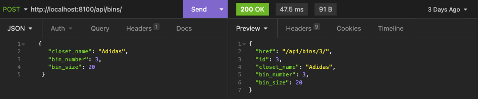

# Wardrobify
Team:
* Jordan Tran - Hats
* Tracey Chung - Shoes

## Starting the Application
Install Docker
For MacOS:
```
brew install --cask docker
```

For Windows:
```
winget install Docker.DockerDesktop
```

To start the application, run the following commands:
```
docker volume create pgdata
docker-compose build
docker-compose up
```

## Design


## Shoes microservice

The shoes microservice uses port 8080 and has two models: the `Shoe` model and the `BinVO` model. The `Shoe` model has a “bin” property which is a foreign key to the `BinVO` model.

- The `Shoe` model has the following properties:

    ```python
    class Shoe(models.Model):
        manufacturer = models.CharField(max_length=250)
        model_name = models.CharField(max_length=250)
        color = models.CharField(max_length=250)
        picture = models.URLField(null=True)
        bin = models.ForeignKey (
            BinVO,
            related_name="shoes",
            on_delete=models.CASCADE
        )
    ```

- The `BinVO` model has the following properties:

    ```python
    class BinVO(models.Model):
        closet_name = models.CharField(max_length=100)
        bin_number = models.PositiveSmallIntegerField()
        bin_size = models.PositiveSmallIntegerField()
        import_href = models.CharField(max_length=200,unique=True)
    ```


The `BinVO` model uses a `get_bins()` function to poll data from the Wardrobe monolith, which uses the port 8100. A bin must exist before adding a shoe to a specific bin. You can create a bin by POSTing to [http://localhost:8100/api/bins](http://localhost:8100/api/bins).


The shoes microservices uses RESTFUL APIs to get a list of shoes, show details for a specific shoe, create a new shoe and delete a specific shoe. The URLs for the shoes microservice are shown below.


For each route, expected response data can be found below:

- `GET` [http://localhost:8080/api/shoes](http://localhost:8080/api/shoes)

    

- `POST` [http://localhost:8080/api/shoes](http://localhost:8080/api/shoes) (please note that “picture” has to be a URL and is optional)

    

- `GET` [http://localhost:8080/api/shoes/<int:pk>](http://localhost:8080/api/shoes/<int:pk>)

    

- `DELETE` [http://localhost:8080/api/shoes/<int:pk>](http://localhost:8080/api/shoes/<int:pk>)

    


The front end has two components - `ShoesList` and `NewShoe`. `NewShoe` fetches data from the Wardrobe monolith in order to get a list of bins to display in the “Bin” dropdown. Once the form is filled, and successfully posted, the new shoe will automatically be displayed in the shoe list. `ShoesList` has a “Delete” feature that will delete the shoe and automatically re-render the page with the updated shoe list.

## Hats microservice

The hats microservice uses port 8090 and consists of two models, `Hats` and `LocationVO`. The `Hats` model has a location property which has a foreign key relationship to `LocationVO`. The `LocationVO` object is created by using a `get_locations()` polling function that makes a request to the monolith(Wardrobe API) locations endpoint and accesses the location data. A location must exist before adding a hat to a specific location. You can create a location by POSTing to [http://localhost:8100/api/locations](http://localhost:8100/api/bins).

RESTFUL API's have been established by creating two endpoints to get a list of hats, show details for a specific hat, create new hats, and deleting hats.


For each route, expected response data can be found below:

- `GET`  [http://localhost:8090/api/hats](http://localhost:8080/api/shoes)

    

- `POST` [http://localhost:8090/api/hats](http://localhost:8080/api/shoes) (please note that “picture_url” is not a required field)

    

- `GET` [http://localhost:8090/api/hats/<int:pk>](http://localhost:8090/api/hats/<int:pk>)

    

- `DELETE` [http://localhost:8090/api/hats/<int:pk>](http://localhost:8090/api/hats/<int:pk>)

    


Frontend side of things, two components were created are `HatsList` and `HatsForm`. `HatForm` fetches data from the monolith in order to get a list of the locations available when creating a form.
